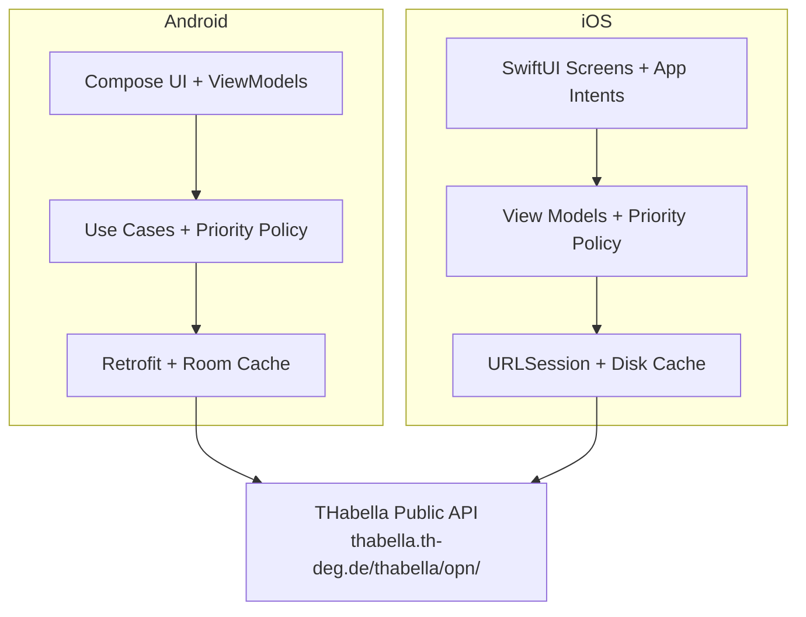

<h1 align="center">
  THD Room Finder
</h1>

<p align="center">
  <strong>Find free study rooms at Technische Hochschule Deggendorf in real time.</strong>
</p>

<p align="center">
  <a href="https://developer.android.com">
    
  </a>
  <a href="https://github.com/arudaev/THD-Room-Finder/wiki/cloud-testing">
    
  </a>
  <a href="https://kotlinlang.org">
    
  </a>
  <a href="https://developer.android.com/jetpack/compose">
    
  </a>
  <a href="https://developer.apple.com/xcode/swiftui/">
    
  </a>
  <a href="#">
    
  </a>
  <a href="LICENSE">
    
  </a>
</p>

---

## Overview

THD Room Finder is a native room finder for **Technische Hochschule Deggendorf (THD)**. The repository now follows a **local-first delivery model**: Android development stays local by default, iOS keeps its native SwiftUI project, GitHub Actions validates both platforms, Appetize provides browser previews, and TestFlight is the supported install path for real iPhone testers.

Both clients query THD's public scheduling system [THabella](https://thabella.th-deg.de) and cross-reference occupied rooms against known rooms to show which classrooms are free right now, or at any future time you choose.

**No accounts. No backend. No configuration.** Just open the app and find a room.

---

## Features

### Core

- **Real-time free room finder** - see which of THD's rooms are available right now
- **Main-campus prioritization** - lecture halls, classrooms, and labs in `A, B, C, D, E, I, ITC, J` are ranked ahead of the rest
- **Building filter** - quickly narrow results by building code
- **Time-based lookup** - pick any future date and time to check availability ahead of schedule
- **Room details** - view capacity, equipment, floor, contact info, and the full day's schedule

### Reliability

- **Offline support** - network-first with local cache fallback
- **Auto-refresh** - silent background polling every 5 minutes keeps data current
- **Defensive parsing** - handles unexpected API changes gracefully without crashing

### Platforms

- **Android app** - shipped as a signed APK in GitHub Releases and previewed in Appetize
- **iOS beta path** - shipped to real devices through TestFlight and previewed in Appetize as a simulator build
- **Native iOS source release** - shipped as an Xcode project bundle for maintainers and local Mac builds
- **iOS Shortcuts support** - includes App Intents for finding free rooms and opening a room directly

### Design

- **Material 3** on Android with dynamic color support on Android 12+
- **SwiftUI** on iPhone with the same core flows and prioritization policy
- **English UI** with original German room and building names preserved where helpful

---

## Architecture



### Android Tech Stack

| Component | Technology |
|-----------|------------|
| Language | Kotlin 2.2 |
| UI | Jetpack Compose + Material 3 |
| Navigation | Compose Navigation |
| Networking | Retrofit 2 + OkHttp |
| Serialization | kotlinx.serialization |
| Local DB | Room |
| DI | Hilt |
| Async | Kotlin Coroutines + Flow |
| Build | Gradle Kotlin DSL + AGP 9 |

### iOS Tech Stack

| Component | Technology |
|-----------|------------|
| Language | Swift 5 |
| UI | SwiftUI |
| System Integration | App Intents + App Shortcuts |
| Networking | URLSession |
| Local Cache | JSON disk cache in Application Support |
| Build | Xcode project in `ios/THDRoomFinder.xcodeproj` |

---

## Getting Started

### Local Android Prerequisites

- **Android Studio** (latest stable, Ladybug or newer)
- **JDK 21** - AGP 9 requires it
- **Android SDK** with API level 36

### Local Android Build and Run

```bash
# Clone the repository
git clone --recurse-submodules https://github.com/arudaev/THD-Room-Finder.git
cd THD-Room-Finder

# Build debug APK
bash scripts/dev/android-build.sh assembleDebug

# Run Android validation
bash scripts/dev/android-test.sh test lint

# Install on a connected device or emulator
./gradlew installDebug
```

> [!IMPORTANT]
> `JAVA_HOME` must point to JDK 21. If using Android Studio's bundled JDK:
> ```bash
> # Windows
> set JAVA_HOME=C:\Program Files\Android\Android Studio\jbr
>
> # macOS / Linux
> export JAVA_HOME="/Applications/Android Studio.app/Contents/jbr/Contents/Home"
> ```

### Optional Codespaces Workspace

If you need a disposable cloud environment, this repository now includes a full [`.devcontainer`](.devcontainer/devcontainer.json) for GitHub Codespaces.

Codespaces provisions:

- JDK 21
- Android SDK command-line tools
- Android platform-tools
- Android API 36 and build-tools 36.1.0
- a persistent Gradle cache volume

Use the same helper commands inside Codespaces:

```bash
bash scripts/dev/android-build.sh assembleDebug
bash scripts/dev/android-test.sh test lint
```

> [!NOTE]
> Codespaces is supported as a backup environment, not the default workflow. iOS builds still require either a Mac with Xcode or GitHub Actions on `macos-latest`.

### Audit THabella Content Locally

If you want to inspect THabella's raw content and the exact normalized data shape the apps use, run:

```bash
python scripts/dev/export-thabella-snapshot.py
```

You can also choose a specific query time:

```bash
python scripts/dev/export-thabella-snapshot.py --date-time "2026-04-14 09:00"
```

By default the script writes into `build/thabella-snapshot/<timestamp>/` and creates:

- `raw/` - untouched THabella room and period payloads
- `normalized/` - cleaned rooms, events, and building summaries
- `app/` - home, room-list, and per-room detail exports shaped like the apps
- `audit/data-quality.json` - content-gap metrics and fallback-title samples
- `summary.md` - a quick human-readable audit report

### iOS Build, Preview, and Install

The repository includes a native SwiftUI iPhone project at `ios/THDRoomFinder.xcodeproj`.

- Maintainers can build locally on macOS with Xcode or [`ios/scripts/build-and-launch.sh`](ios/scripts/build-and-launch.sh)
- Browser previews are published through Appetize from `main`
- Real iPhone testers install the app through TestFlight
- Public GitHub Releases include the iOS source bundle, not an installable iPhone binary

See [the cloud workflow guide](https://github.com/arudaev/THD-Room-Finder/wiki/cloud-testing) for the CI/CD and preview flow and [the iOS build and sideload guide](https://github.com/arudaev/THD-Room-Finder/wiki/iOS-Build-and-Sideload) for the maintainer build path.

---

## Project Structure

```text
app/src/main/java/de/thd/roomfinder/
|- data/               # Room DB entities, DAOs, mappers, remote DTOs, repository
|- di/                 # Hilt modules
|- domain/             # Models, policy, repository interfaces, use cases
|- ui/                 # Compose screens, components, navigation, theme, viewmodels
`- util/               # Constants

ios/
|- THDRoomFinder.xcodeproj/  # Native iPhone Xcode project
|- THDRoomFinder/            # SwiftUI app source, data layer, intents, resources
`- THDRoomFinderTests/       # iOS unit tests

docs/
|- cloud-testing.md          # Local-first CI/CD, Appetize, TestFlight, and Codespaces guide
`- iOS-Build-and-Sideload.md # Maintainer Xcode build and sideload guide

.devcontainer/
|- devcontainer.json         # Optional Codespaces / devcontainer setup
`- Dockerfile                # Android-ready container image

scripts/
|- dev/                      # Local Android build/test helpers
`- ci/                       # CI packaging and upload helpers
```

---

## CI/CD

### Continuous Integration

Every push to `main` and every pull request triggers the **CI** workflow:

- builds the Android debug APK
- runs Android unit tests and lint
- builds the iOS app for the simulator
- runs `THDRoomFinderTests` on `iPhone 16 (OS latest)`

### Appetize Previews

Pushes to `main` and manual `workflow_dispatch` runs trigger the **Appetize Previews** workflow:

- Android preview uploads the debug `.apk`
- iOS preview uploads a zipped simulator `.app`
- preview URLs are written into the Actions job summaries
- repository variables can pin stable Appetize targets for Android and iOS main previews

### Releases

Pushing a version tag triggers the **Release** workflow:

```bash
git tag v1.0.0
git push origin v1.0.0
```

This will:

1. Validate Android and iOS builds.
2. Build a signed Android release APK.
3. Bundle the native iOS Xcode project into an `iOS source` zip.
4. Upload an iOS beta build to TestFlight when the Apple credentials are configured.
5. Create a GitHub Release with the Android APK and iOS source zip attached.

> [!IMPORTANT]
> GitHub Releases do **not** include an installable iOS binary. Real iPhone installs are supported through TestFlight only.

> [!NOTE]
> Required GitHub secrets and variables:
>
> | Name | Type | Description |
> |------|------|-------------|
> | `KEYSTORE_BASE64` | Secret | Base64-encoded Android release keystore |
> | `KEYSTORE_PASSWORD` | Secret | Android keystore password |
> | `KEY_ALIAS` | Secret | Android signing key alias |
> | `KEY_PASSWORD` | Secret | Android signing key password |
> | `APPETIZE_API_TOKEN` | Secret | API token for Appetize uploads |
> | `APPETIZE_ANDROID_MAIN_PUBLIC_KEY` | Variable | Stable Appetize app key for Android previews |
> | `APPETIZE_IOS_MAIN_PUBLIC_KEY` | Variable | Stable Appetize app key for iOS previews |
> | `APP_STORE_CONNECT_ISSUER_ID` | Secret | App Store Connect issuer ID |
> | `APP_STORE_CONNECT_KEY_ID` | Secret | App Store Connect API key ID |
> | `APP_STORE_CONNECT_PRIVATE_KEY` | Secret | App Store Connect `.p8` private key |
> | `APPLE_TEAM_ID` | Secret | Apple Developer team ID used for signing |
> | `APP_STORE_CONNECT_CERTIFICATES_FILE_BASE64` | Secret | Base64-encoded iOS distribution certificate `.p12` |
> | `APP_STORE_CONNECT_CERTIFICATES_PASSWORD` | Secret | Password for the `.p12` certificate |

---

## Testing

The Android project includes unit tests for:

- DTO parsing and mapper behavior
- free-room and room-schedule business logic
- view-model state handling
- new main-campus priority sorting behavior

The iOS project includes unit tests for:

- room-priority policy classification
- room-list query handling for building and date/time inputs

Run Android validation locally with:

```bash
bash scripts/dev/android-test.sh test lint
```

> [!IMPORTANT]
> Android test execution in a fresh local environment still requires `ANDROID_HOME` or `local.properties` to point to a valid Android SDK.

End-to-end delivery testing now also includes:

- GitHub Actions Android validation on `ubuntu-latest`
- GitHub Actions iOS simulator validation on `macos-latest`
- Appetize browser previews for Android and iOS from `main`
- TestFlight beta delivery for iPhone testers on tagged releases

---

## THabella API

The app communicates directly with THD's public scheduling system. No authentication is required.

| Endpoint | Method | Purpose |
|----------|--------|---------|
| `/room/findRooms` | POST | Fetch all rooms |
| `/period/findByDate/{dateTime}` | POST | Fetch events for a given date |

> [!WARNING]
> THabella has no official public API documentation. These endpoints were reverse-engineered from its frontend and could change without notice.

---

## Troubleshooting

<details>
<summary><strong>Android build fails with JDK errors</strong></summary>

AGP 9 requires JDK 21. Make sure `JAVA_HOME` points to JDK 21, not JDK 8 or 17.
</details>

<details>
<summary><strong>Android tests fail because the SDK is missing</strong></summary>

Create `local.properties` or set `ANDROID_HOME` to a valid Android SDK installation.
</details>

<details>
<summary><strong>iOS project opens but will not run on device</strong></summary>

For the supported tester path, use TestFlight. For personal maintainer builds, set your Apple ID team in Xcode and, if needed, change the bundle identifier to a unique personal value before building to your phone.
</details>

<details>
<summary><strong>Codespaces builds Android but cannot build iOS</strong></summary>

That is expected. Codespaces is an Android and tooling workspace only. iOS builds require GitHub Actions on `macos-latest` or a Mac with Xcode.
</details>

---

## Documentation

Additional documentation:

- [Cloud Workflow Guide](https://github.com/arudaev/THD-Room-Finder/wiki/cloud-testing)
- [iOS Build and Sideload Guide](https://github.com/arudaev/THD-Room-Finder/wiki/iOS-Build-and-Sideload)
- [Project Wiki](https://github.com/arudaev/THD-Room-Finder/wiki)

---

## Academic Project

> [!NOTE]
> This application was developed as part of coursework at **Technische Hochschule Deggendorf (THD)**.

---

## License

This project is licensed under the GNU General Public License v3.0. See [LICENSE](LICENSE) for details.

---

<p align="center">
  <em>Built for THD students who just need a quiet room to study.</em>
</p>
