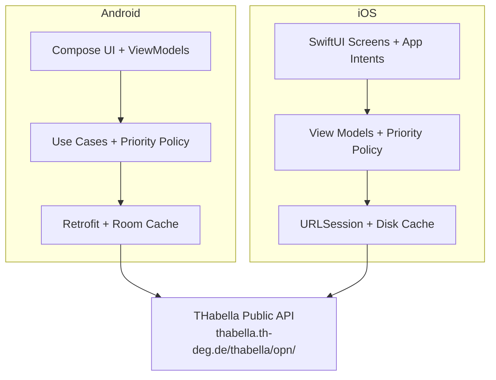

<h1 align="center">
  THD Room Finder
</h1>

<p align="center">
  <strong>Find free study rooms at Technische Hochschule Deggendorf in real time.</strong>
</p>

<p align="center">
  <a href="https://developer.android.com">
    
  </a>
  <a href="docs/iOS-Build-and-Sideload.md">
    
  </a>
  <a href="https://kotlinlang.org">
    
  </a>
  <a href="https://developer.android.com/jetpack/compose">
    
  </a>
  <a href="https://developer.apple.com/xcode/swiftui/">
    
  </a>
  <a href="#">
    
  </a>
  <a href="LICENSE">
    
  </a>
</p>

---

## Overview

THD Room Finder is a native room finder for **Technische Hochschule Deggendorf (THD)**. The production app is Android, and this repository now also includes a native SwiftUI iPhone project for local Xcode builds and personal-device sideloading.

Both clients query THD's public scheduling system [THabella](https://thabella.th-deg.de) and cross-reference occupied rooms against known rooms to show which classrooms are free right now, or at any future time you choose.

**No accounts. No backend. No configuration.** Just open the app and find a room.

---

## Features

### Core

- **Real-time free room finder** - see which of THD's rooms are available right now
- **Main-campus prioritization** - lecture halls, classrooms, and labs in `A, B, C, D, E, I, ITC, J` are ranked ahead of the rest
- **Building filter** - quickly narrow results by building code
- **Time-based lookup** - pick any future date and time to check availability ahead of schedule
- **Room details** - view capacity, equipment, floor, contact info, and the full day's schedule

### Reliability

- **Offline support** - network-first with local cache fallback
- **Auto-refresh** - silent background polling every 5 minutes keeps data current
- **Defensive parsing** - handles unexpected API changes gracefully without crashing

### Platforms

- **Android app** - shipped as a signed APK in GitHub releases
- **Native iOS source release** - shipped as an Xcode project bundle for simulator builds and personal-device sideloading
- **iOS Shortcuts support** - includes App Intents for finding free rooms and opening a room directly

### Design

- **Material 3** on Android with dynamic color support on Android 12+
- **SwiftUI** on iPhone with the same core flows and prioritization policy
- **English UI** with original German room and building names preserved where helpful

---

## Architecture



### Android Tech Stack

| Component | Technology |
|-----------|------------|
| Language | Kotlin 2.2 |
| UI | Jetpack Compose + Material 3 |
| Navigation | Compose Navigation |
| Networking | Retrofit 2 + OkHttp |
| Serialization | kotlinx.serialization |
| Local DB | Room |
| DI | Hilt |
| Async | Kotlin Coroutines + Flow |
| Build | Gradle Kotlin DSL + AGP 9 |

### iOS Tech Stack

| Component | Technology |
|-----------|------------|
| Language | Swift 5 |
| UI | SwiftUI |
| System Integration | App Intents + App Shortcuts |
| Networking | URLSession |
| Local Cache | JSON disk cache in Application Support |
| Build | Xcode project in `ios/THDRoomFinder.xcodeproj` |

---

## Getting Started

### Android Prerequisites

- **Android Studio** (latest stable, Ladybug or newer)
- **JDK 21** - AGP 9 requires it
- **Android SDK** with API level 36

### Android Build and Run

```bash
# Clone the repository
git clone --recurse-submodules https://github.com/arudaev/THD-Room-Finder.git
cd THD-Room-Finder

# Build debug APK
./gradlew assembleDebug

# Run unit tests
./gradlew test

# Run lint checks
./gradlew lint

# Install on a connected device or emulator
./gradlew installDebug
```

> [!IMPORTANT]
> `JAVA_HOME` must point to JDK 21. If using Android Studio's bundled JDK:
> ```bash
> # Windows
> set JAVA_HOME=C:\Program Files\Android\Android Studio\jbr
>
> # macOS / Linux
> export JAVA_HOME="/Applications/Android Studio.app/Contents/jbr/Contents/Home"
> ```

### iOS Source Build

The repository includes a native SwiftUI iPhone project at `ios/THDRoomFinder.xcodeproj`.

- Open the project in Xcode on macOS
- Choose an iPhone simulator or your own device
- For personal-device sideloading, set your Apple ID team in `Signing & Capabilities`

See [docs/iOS-Build-and-Sideload.md](docs/iOS-Build-and-Sideload.md) for the complete guide and current Apple distribution constraints.

---

## Project Structure

```text
app/src/main/java/de/thd/roomfinder/
|- data/               # Room DB entities, DAOs, mappers, remote DTOs, repository
|- di/                 # Hilt modules
|- domain/             # Models, policy, repository interfaces, use cases
|- ui/                 # Compose screens, components, navigation, theme, viewmodels
`- util/               # Constants

ios/
|- THDRoomFinder.xcodeproj/  # Native iPhone Xcode project
|- THDRoomFinder/            # SwiftUI app source, data layer, intents, resources
`- THDRoomFinderTests/       # iOS unit tests

docs/
`- iOS-Build-and-Sideload.md # Xcode build and personal-device install guide
```

---

## CI/CD

### Continuous Integration

Every push to `main` and every pull request triggers the **CI** workflow:

- builds a debug APK
- runs Android unit tests
- runs lint checks

### Releases

Pushing a version tag triggers the **Release** workflow:

```bash
git tag v1.0.0
git push origin v1.0.0
```

This will:

1. Run the Android test suite
2. Build a signed release APK
3. Bundle the native iOS Xcode project and sideload guide into an `iOS source` zip
4. Create a GitHub Release with both assets attached

> [!NOTE]
> Required GitHub Secrets for signed Android releases:
>
> | Secret | Description |
> |--------|-------------|
> | `KEYSTORE_BASE64` | Base64-encoded release keystore |
> | `KEYSTORE_PASSWORD` | Keystore password |
> | `KEY_ALIAS` | Key alias name |
> | `KEY_PASSWORD` | Key password |

---

## Testing

The Android project includes unit tests for:

- DTO parsing and mapper behavior
- free-room and room-schedule business logic
- view-model state handling
- new main-campus priority sorting behavior

The iOS project includes unit tests for:

- room-priority policy classification
- room-list query handling for building and date/time inputs

Run Android tests with:

```bash
./gradlew test
```

> [!IMPORTANT]
> Android test execution in a fresh local environment still requires `ANDROID_HOME` or `local.properties` to point to a valid Android SDK.

---

## THabella API

The app communicates directly with THD's public scheduling system. No authentication is required.

| Endpoint | Method | Purpose |
|----------|--------|---------|
| `/room/findRooms` | POST | Fetch all rooms |
| `/period/findByDate/{dateTime}` | POST | Fetch events for a given date |

> [!WARNING]
> THabella has no official public API documentation. These endpoints were reverse-engineered from its frontend and could change without notice.

---

## Troubleshooting

<details>
<summary><strong>Android build fails with JDK errors</strong></summary>

AGP 9 requires JDK 21. Make sure `JAVA_HOME` points to JDK 21, not JDK 8 or 17.
</details>

<details>
<summary><strong>Android tests fail because the SDK is missing</strong></summary>

Create `local.properties` or set `ANDROID_HOME` to a valid Android SDK installation.
</details>

<details>
<summary><strong>iOS project opens but will not run on device</strong></summary>

Set your Apple ID team in Xcode, and if needed, change the bundle identifier to a unique personal value before building to your phone.
</details>

---

## Documentation

Additional documentation:

- [iOS Build and Sideload Guide](docs/iOS-Build-and-Sideload.md)
- [Project Wiki](https://github.com/arudaev/THD-Room-Finder/wiki)

---

## Academic Project

> [!NOTE]
> This application was developed as part of coursework at **Technische Hochschule Deggendorf (THD)**.

---

## License

This project is licensed under the GNU General Public License v3.0. See [LICENSE](LICENSE) for details.

---

<p align="center">
  <em>Built for THD students who just need a quiet room to study.</em>
</p>
