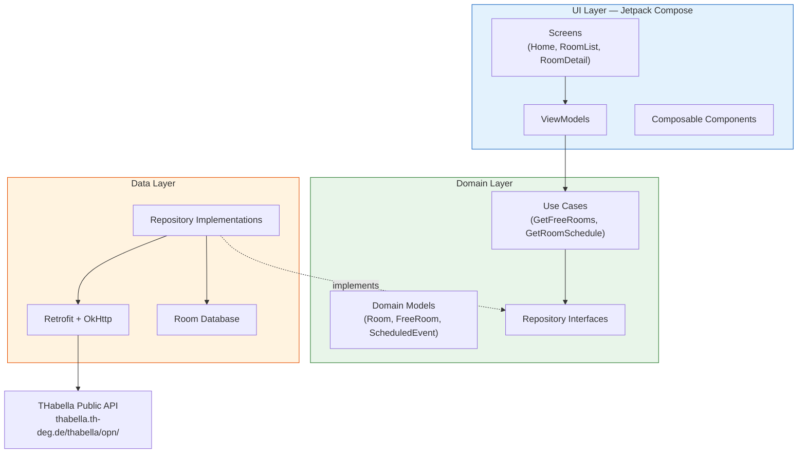

<h1 align="center">
  THD Room Finder
</h1>

<p align="center">
  <strong>Find free study rooms at Technische Hochschule Deggendorf — in real time.</strong>
</p>

<p align="center">
  <a href="https://developer.android.com">
    
  </a>
  <a href="https://kotlinlang.org">
    
  </a>
  <a href="https://developer.android.com/jetpack/compose">
    
  </a>
  <a href="https://m3.material.io">
    
  </a>
  <a href="#">
    
  </a>
  <a href="LICENSE">
    
  </a>
</p>

---

## Overview

THD Room Finder is a native Android app that helps students at **Technische Hochschule Deggendorf (THD)** instantly find available study rooms. It queries THD's public scheduling system [THabella](https://thabella.th-deg.de) and cross-references occupied rooms against all known rooms to show which classrooms are free right now — or at any future time you choose.

**No accounts. No backend. No configuration.** Just open the app and find a room.

---

## Features

### Core

- **Real-time free room finder** — see which of THD's 289 rooms are available right now
- **Building filter** — quickly narrow results by building code (A, B, C, D, I, ITC, ...)
- **Time-based lookup** — pick any future date and time to check room availability ahead of schedule
- **Room details** — view capacity, equipment, floor, contact info, and the full day's schedule

### Reliability

- **Offline support** — network-first with local Room DB fallback (24h TTL for rooms, 5min for events)
- **Auto-refresh** — silent background polling every 5 minutes keeps data current
- **Defensive parsing** — handles unexpected API changes gracefully without crashing

### Design

- **Material 3** with dynamic color support on Android 12+
- **Dark mode** follows system preference
- **English UI** with original German room and building names preserved

---

## Architecture



**Pattern:** MVVM with Clean Architecture. Unidirectional data flow (UDF).

### Tech Stack

| Component | Technology |
|-----------|------------|
| **Language** | Kotlin 2.2 |
| **UI** | Jetpack Compose + Material 3 |
| **Navigation** | Compose Navigation |
| **Networking** | Retrofit 2 + OkHttp |
| **Serialization** | kotlinx.serialization |
| **Local DB** | Room (caching + offline) |
| **DI** | Hilt (Dagger) |
| **Async** | Kotlin Coroutines + Flow |
| **Build** | Gradle (Kotlin DSL) + AGP 9 |
| **Min SDK** | 26 (Android 8.0) |
| **Target SDK** | 36 |

---

## Getting Started

### Prerequisites

- **Android Studio** (latest stable, Ladybug or newer)
- **JDK 21** — AGP 9 requires it. Android Studio bundles a compatible JDK.
- **Android SDK** with API level 36

### Build & Run

```bash
# Clone the repository
git clone --recurse-submodules https://github.com/arudaev/THD-Room-Finder.git
cd THD-Room-Finder

# Build debug APK
./gradlew assembleDebug

# Run unit tests
./gradlew test

# Run lint checks
./gradlew lint

# Install on a connected device or emulator
./gradlew installDebug
```

> [!IMPORTANT]
> **JAVA_HOME** must point to JDK 21. If using Android Studio's bundled JDK:
> ```bash
> # Windows
> set JAVA_HOME=C:\Program Files\Android\Android Studio\jbr
>
> # macOS / Linux
> export JAVA_HOME="/Applications/Android Studio.app/Contents/jbr/Contents/Home"
> ```

---

## Project Structure

```
app/src/main/java/de/thd/roomfinder/
├── data/
│   ├── local/           # Room DB entities, DAOs, database
│   ├── mapper/          # DTO ↔ Domain mappers
│   ├── remote/          # Retrofit API service + DTOs
│   └── repository/      # Repository implementations
├── di/                  # Hilt DI modules
├── domain/
│   ├── model/           # Room, FreeRoom, ScheduledEvent, Building
│   ├── repository/      # Repository interfaces
│   └── usecase/         # GetFreeRoomsUseCase, GetRoomScheduleUseCase
├── ui/
│   ├── component/       # RoomCard, ScheduleCard, BuildingFilterRow, ...
│   ├── navigation/      # NavHost + Route sealed class
│   ├── screen/          # HomeScreen, RoomListScreen, RoomDetailScreen
│   ├── theme/           # Material 3 colors, typography, theme
│   └── viewmodel/       # HomeViewModel, RoomListViewModel, RoomDetailViewModel
├── util/                # Constants
└── THDRoomFinderApp.kt  # Hilt application class
```

---

## CI/CD

### Continuous Integration

Every push to `main` and every pull request triggers the **CI** workflow:
- Builds a debug APK
- Runs all unit tests
- Runs lint checks

### Releases

Pushing a version tag triggers the **Release** workflow:

```bash
git tag v1.0.0
git push origin v1.0.0
```

This will:
1. Run the full test suite
2. Build a signed release APK
3. Create a GitHub Release with the APK attached and auto-generated release notes

> [!NOTE]
> **Required GitHub Secrets** for signed releases:
>
> | Secret | Description |
> |--------|-------------|
> | `KEYSTORE_BASE64` | Base64-encoded release keystore (`base64 -w 0 release.keystore`) |
> | `KEYSTORE_PASSWORD` | Keystore password |
> | `KEY_ALIAS` | Key alias name |
> | `KEY_PASSWORD` | Key password |
>
> Generate a keystore: `keytool -genkey -v -keystore release.keystore -keyalg RSA -keysize 2048 -validity 10000 -alias release`

---

## Testing

The project includes **20+ unit tests** covering:

| Layer | What's tested |
|-------|---------------|
| **Mappers** | `RoomMapper`, `PeriodMapper` — DTO to domain model conversion |
| **DTO parsing** | JSON deserialization of `RoomDto` and `PeriodDto` |
| **Use cases** | `GetFreeRoomsUseCase`, `GetRoomScheduleUseCase` — business logic |
| **ViewModels** | `HomeViewModel`, `RoomListViewModel`, `RoomDetailViewModel` — state management |

Tests use **fakes** (not mocks) for the repository layer, with a `FakeRoomRepository` that provides controllable results and call tracking.

```bash
# Run all unit tests
./gradlew test

# Run with test report
./gradlew test --info
```

---

## THabella API

The app communicates directly with THD's public scheduling system. No authentication is required.

| Endpoint | Method | Purpose |
|----------|--------|---------|
| `/room/findRooms` | POST | Fetch all 289 rooms |
| `/period/findByDate/{dateTime}` | POST | Fetch events for a given date |

For full API documentation including request/response schemas, see the [API Reference](docs/API-Reference.md) wiki page.

> [!WARNING]
> THabella has no official public API docs. These endpoints were reverse-engineered from its frontend source code and could change without notice.

---

## Troubleshooting

<details>
<summary><strong>Build fails with "invalid source release" or JDK errors</strong></summary>

AGP 9 requires JDK 21. Make sure `JAVA_HOME` points to a JDK 21 installation, not JDK 8 or 17.
</details>

<details>
<summary><strong>Windows: file lock errors on <code>app/build/test-results/</code></strong></summary>

Kill orphaned Gradle daemons and clear the locked directory:
```bash
taskkill /F /IM java.exe
rm -rf app/build/test-results
```
</details>

<details>
<summary><strong>Hilt compilation fails with "BaseExtension not found"</strong></summary>

Ensure Hilt version is 2.59.1 or higher. Earlier versions are not compatible with AGP 9.
</details>

<details>
<summary><strong>FlowRow crashes at runtime</strong></summary>

`FlowRow` has a known `NoSuchMethodError` with Compose BOM 2024.09.00 on AGP 9. The app avoids `FlowRow` and uses `LazyRow` instead.
</details>

---

## Documentation

Detailed documentation is available in the [project wiki](https://github.com/arudaev/THD-Room-Finder/wiki):

- [**Architecture**](https://github.com/arudaev/THD-Room-Finder/wiki/Architecture) — layers, data flow, caching strategy
- [**API Reference**](https://github.com/arudaev/THD-Room-Finder/wiki/API-Reference) — THabella endpoints and schemas
- [**Building from Source**](https://github.com/arudaev/THD-Room-Finder/wiki/Building-from-Source) — complete setup guide
- [**App Features**](https://github.com/arudaev/THD-Room-Finder/wiki/App-Features) — detailed feature documentation
- [**Contributing**](https://github.com/arudaev/THD-Room-Finder/wiki/Contributing) — how to contribute

---

## Academic Project

> [!NOTE]
> This application was developed as part of coursework at **Technische Hochschule Deggendorf (THD)** — Deggendorf Institute of Technology.

---

## License

This project is licensed under the GNU General Public License v3.0 — see the [LICENSE](LICENSE) file for details.

---

<p align="center">
  <em>Built for THD students who just need a quiet room to study.</em>
</p>
